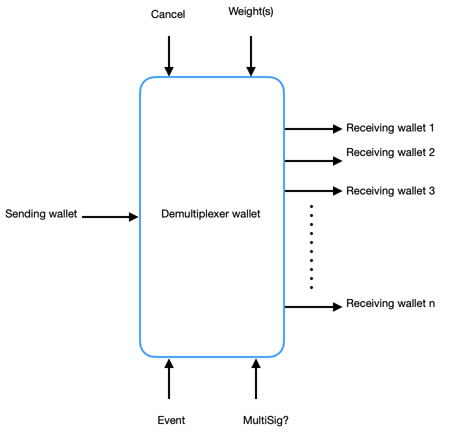

# demultiplexer-wallet
one (wallet) to many (wallets) transfer capability smart contract, on Starknet L2

### Trying to achieve the following:

With this wallet we can connect a wallet and input some configurations to the Demux-Wallet to be able to send to multiple receiving wallets to either eth, ERC20 or ERC721 based on an event configuration (either a manual triggered event or time based event), as well as potentially supporting recurring transactions.

### Sending wallet: must contain funds
#### Configuration: 
##### Number of outputs: 
###### the number of receiving wallets or addresses tbd
##### weights: 
###### a weight/percentage to each receiving wallet (the weights/percentage sum should be less than 1/100% for all transactions, tbd: maybe not necessarily including securing transactions)
##### outputs: 
###### wallets addresses if known to start with, then possibly support creating of wallets dynamically 
##### multisig: 
###### once the user created a new Demux-wallet with pending transactions, we need a way to unlock the funds in case we want to cancel or retrieve the funds if the user is not available anymore to avoid permanent loss we might need a secondary wallet address to divert the funds to
##### Event is defined by two properties
###### eventType: at the moment there are two type of events, one shot or recurring
###### enventSchedule: instant or delayed
##### Cancel: 
###### Event? Nuke the transaction, voluntary from the user, 
###### ExpiryDate

### 1st steps

- Learn Cairo, tut
- Env
- 1st steps for poc
- Create wallet that user can input all config
- Check for funds are enough to cover what the user chose to send
- Validate all configs, weights….
- Store all into the contract
- Create logic to handle splitting the funds
- Look at integrating yogi for one off shot task in the future
- Check how to sign for future transfers
- Do we use a placeholder for the funds, how to lock the funds?
- Cancellation? God mode: define the boundaries
- Obviously test the shit out of ^^

Then we should be in business,

### Need to check EIP-4626: Tokenized Vault Standard 

Playing with POC:

- Set total amount to send
- Set addresses to send to
- Add weight for each wallet (equal for each or not)
- One off shot/ recurring
- Date to send it
- Expiry date

